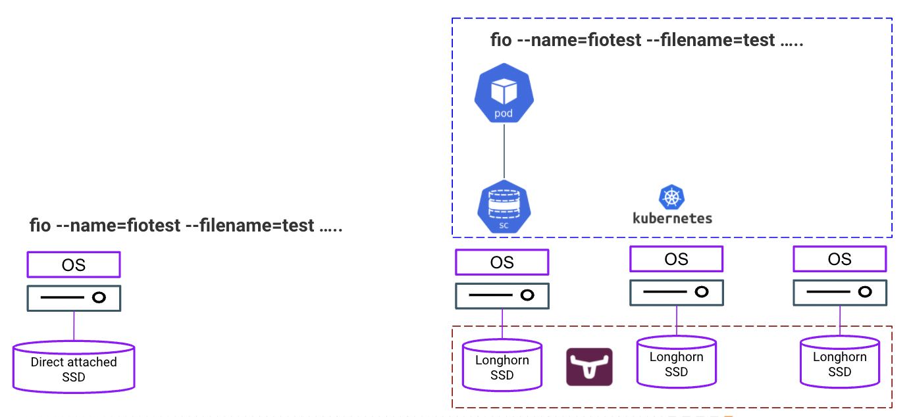
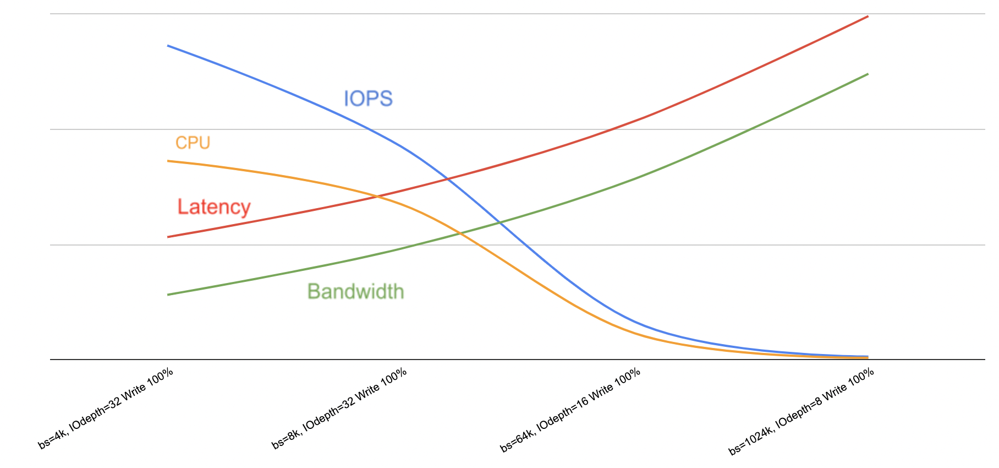
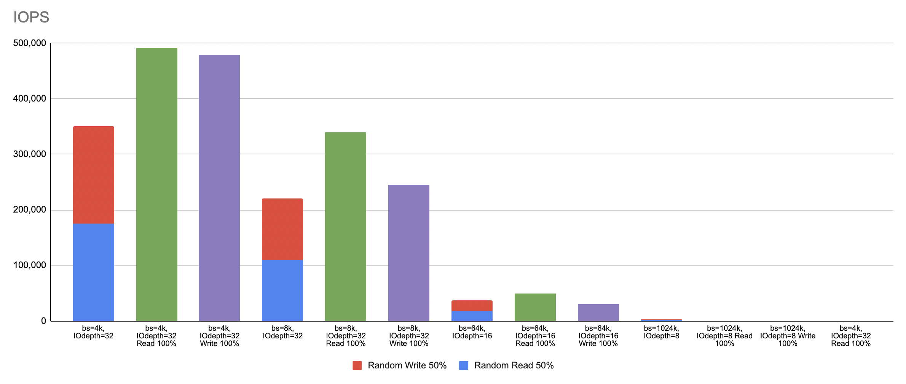
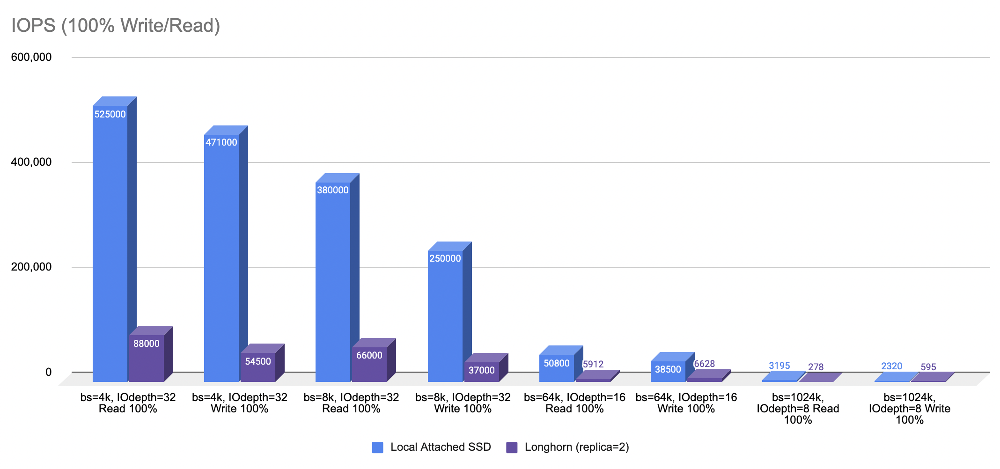

# Longhorn Performance Benchmarking
{: .no_toc }

Longhorn is the cloud native distributed block storage in the Kubernetes ecosystem. It is an open source software defined storage that synchronously replicates the volumes across multiple Kubernetes nodes to achieve high availability and high degree of resiliency. Longhorn volume replicas are hosted on separate nodes to prevent single point of failure. In a nutshell, Longhorn volume is used as the fault-tolerant persistent volume for the stateful pods in Kubernetes. 

The objective of running these performance benchmarking tests is to gauge the output in terms of IOPS, latency, bandwidth and CPU usage when the stateful pods use the Longhorn storage on a specific hardware model in the Kubernetes cluster.

- TOC
{:toc}

---


## Hardware

- The performance benchmarking tests were carried out using the following hardware specification.

| CPU          | Intel(R) Xeon(R) Gold 5220R CPU @ 2.20GHz | 
| Memory  | DIMM DDR4 Synchronous Registered (Buffered) 2933 MHz (0.3 ns) | 
| Disk | NVMe P4610 1.6TB SFF    | 

- The datasheet for the storage disk `NVMe P4610` can be obtained [here](https://ark.intel.com/content/www/us/en/ark/products/140103/intel-ssd-dc-p4610-series-1-6tb-2-5in-pcie-3-1-x4-3d2-tlc.html). The performance specifications stated in this datasheet can be used to benchmark against the result of the tests.

## Architecture

- The Longhorn performance test was carried out in a Kubernetes cluster with 3 physical nodes connected to each other on the same subnet. Each test ran inside the stateful pod that was attached to the storage class backed by the Longhorn persistent volume with replica size 2 and 3.
- The local attached storage performance test was carried out directly on the operating system of the physical server.

 

## Storage Performance Tool

- `fio` is used as the storage performance tool using different block size (bs) and IOdepth as illustrated in the following table. Part of the tests were performed based on random 50% read and 50% write (files scattered around the disk). The rest were based on sequential 100% read and 100% write operations.

| Block Size (bs)      | IOdepth         |
|:-------------|:------------------|
| 4k          | 32        | 
| 8k        | 32         | 
| 64k       | 16           | 
| 1024k     | 8          | 


- The full `fio` command with random 50% read and 50% write operation is shown as follows.

```yaml
fio --name=fiotest --filename=test --size=10Gb --numjobs=8 --ioengine=libaio --group_reporting --runtime=60 --startdelay=60 --bs=8k --iodepth=32 --rw=randrw --direct=1 --rwmixread=50
```

- The full `fio` command for write only is shown as follows.

```yaml
fio --name=fiotest --filename=test --size=10Gb --direct=1 --numjobs=8 --ioengine=libaio --group_reporting --runtime=60 --startdelay=60 --bs=8k --iodepth=32 --rw=write
```

- When testing the Longhorn performance, the abovementioned commands were run inside the Kubernetes pod as illustrated in the following example.

```bash
# kubectl exec -ti fio-0 -n test -- /bin/bash
[root@fio-0 /]# fio --name=fiotest --filename=test --size=10Gb --rw=randrw --direct=1 --rwmixread=50 --numjobs=8 --ioengine=libaio --group_reporting --runtime=60 --startdelay=60 --bs=1M --iodepth=8
fiotest: (g=0): rw=randrw, bs=(R) 1024KiB-1024KiB, (W) 1024KiB-1024KiB, (T) 1024KiB-1024KiB, ioengine=libaio, iodepth=8
...
fio-3.7
Starting 8 processes
fiotest: Laying out IO file (1 file / 10240MiB)
^Cbs: 8 (f=8): [m(8)][86.7%][r=266MiB/s,w=256MiB/s][r=266,w=256 IOPS][eta 00m:16s]
fio: terminating on signal 2
Jobs: 8 (f=8): [m(8)][87.5%][r=238MiB/s,w=250MiB/s][r=238,w=250 IOPS][eta 00m:15s]
fiotest: (groupid=0, jobs=8): err= 0: pid=119: Wed May  4 01:59:49 2022
   read: IOPS=246, BW=246MiB/s (258MB/s)(10.6GiB/44238msec)
    slat (usec): min=10, max=110765, avg=3027.79, stdev=10297.34
    clat (msec): min=8, max=343, avg=92.82, stdev=35.80
     lat (msec): min=8, max=343, avg=95.85, stdev=37.22
    clat percentiles (msec):
     |  1.00th=[   26],  5.00th=[   44], 10.00th=[   51], 20.00th=[   66],
     | 30.00th=[   73], 40.00th=[   80], 50.00th=[   91], 60.00th=[  100],
     | 70.00th=[  106], 80.00th=[  121], 90.00th=[  138], 95.00th=[  157],
     | 99.00th=[  201], 99.50th=[  224], 99.90th=[  284], 99.95th=[  305],
     | 99.99th=[  326]
   bw (  KiB/s): min=10240, max=57344, per=12.51%, avg=31559.36, stdev=7650.58, samples=704
   iops        : min=   10, max=   56, avg=30.76, stdev= 7.46, samples=704
  write: IOPS=252, BW=252MiB/s (264MB/s)(10.9GiB/44238msec)
    slat (usec): min=60, max=196760, avg=14803.03, stdev=18096.68
    clat (msec): min=27, max=444, avg=145.26, stdev=53.50
     lat (msec): min=31, max=445, avg=160.07, stdev=55.94
    clat percentiles (msec):
     |  1.00th=[   61],  5.00th=[   75], 10.00th=[   86], 20.00th=[  101],
     | 30.00th=[  110], 40.00th=[  124], 50.00th=[  136], 60.00th=[  150],
     | 70.00th=[  167], 80.00th=[  186], 90.00th=[  220], 95.00th=[  249],
     | 99.00th=[  305], 99.50th=[  321], 99.90th=[  372], 99.95th=[  388],
     | 99.99th=[  414]
   bw (  KiB/s): min=18432, max=49152, per=12.48%, avg=32225.72, stdev=5107.40, samples=704
   iops        : min=   18, max=   48, avg=31.41, stdev= 5.00, samples=704
  lat (msec)   : 10=0.01%, 20=0.16%, 50=4.78%, 100=35.66%, 250=56.93%
  lat (msec)   : 500=2.46%
  cpu          : usr=0.42%, sys=0.69%, ctx=15497, majf=0, minf=81
  IO depths    : 1=0.1%, 2=0.1%, 4=0.1%, 8=99.7%, 16=0.0%, 32=0.0%, >=64=0.0%
     submit    : 0=0.0%, 4=100.0%, 8=0.0%, 16=0.0%, 32=0.0%, 64=0.0%, >=64=0.0%
     complete  : 0=0.0%, 4=100.0%, 8=0.1%, 16=0.0%, 32=0.0%, 64=0.0%, >=64=0.0%
     issued rwts: total=10900,11151,0,0 short=0,0,0,0 dropped=0,0,0,0
     latency   : target=0, window=0, percentile=100.00%, depth=8

Run status group 0 (all jobs):
   READ: bw=246MiB/s (258MB/s), 246MiB/s-246MiB/s (258MB/s-258MB/s), io=10.6GiB (11.4GB), run=44238-44238msec
  WRITE: bw=252MiB/s (264MB/s), 252MiB/s-252MiB/s (264MB/s-264MB/s), io=10.9GiB (11.7GB), run=44238-44238msec
```


## Some Storage Facts

- IOPS, bandwidth and latency are the common performance indicators from the storage perspective. 
- IOPS (Input/output Operations Per Second) represents the number of requests being sent to the storage disk per one second. IOPS could be measured in read or write operation - random or sequential.
- Bandwidth or throughput is a metric measuring the amount of data that the application sends to the disk in a specified interval.
- Latency measures the time taken to send and receive the data bits to and from the storage disk respectively.
- The graph below shows that both bandwidth and latency increase when the block size is higher with IOPS decreases.
- Generally, the block size for data warehouse is typically higher than OLTP (Online Transaction Processing) systems. This is because data warehouse tends to require high bandwidth whereas OLTP system requires high IOPS. High IOPS can be achieved at the expense of low bandwidth. In short, block size should be configured appropriately based on the characteristics of the workloads.

 

- Sequential data with either 100% read or 100% write produces higher IOPS significantly in comparison to operation with random 50% read and 50% write as shown below. 

 

## Longhorn vs Local Attached Storage

- Any software defined storage is expected to perform lower than the local attached storage. This is because a typical software defined storage like Longhorn replicates the data synchronously to achieve high availability. The question is, to what extent the performance penalty is at stake. 
- The following graph shows the performance difference between both storage variants as the result of a series of tests using different block size, IOdepth and read/write operation.

 

- Note that the above result is generated using SSD as the storage disk. Spinning disk could produce much lower performance in comparison to SSD.

## Longhorn replica size 2 vs size 3 

- The following graph illustrates the performance output as a result of using Longhorn volume with replica size 2 and replica size 3.

 

- The result seemingly implies that there is no significant performance difference between replica size 2 and size 3 in a small Kubernetes cluster. Replica size 3 ensures higher redundancy but at the expense of higher cost by involving more node to store the data. Replica size 2, on the other hand, reduces hardware cost but at the expense of lower redundancy.
- Read operation yields higher IOPS compared to write operation.
- Block size with 64k and 1024k reduce IOPS significantly. 

